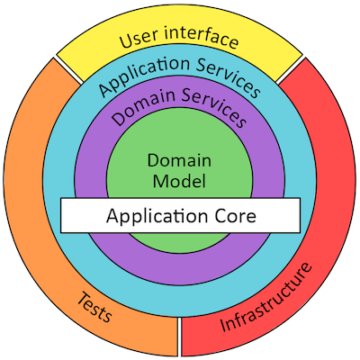
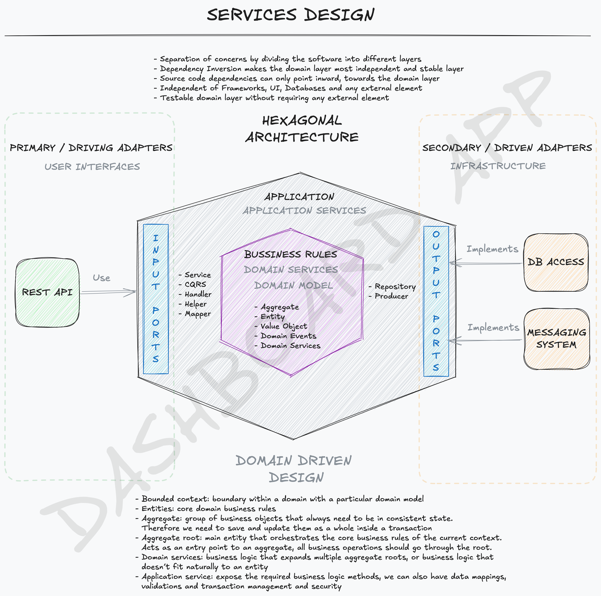

# Dashboard Application

## Features

This application will provide:
* Take control of your finances

## Infrastructure

### Branch Protection

As the main branch "master" will be used for generating releases, this branch must be always in a deployable state, which will be archived by:
* Branch protection rules. Not allowing direct pushes. require up-to-date branches in pull requests before merging
* Linting. SonarQube Scan (https://sonarcloud.io/project/configuration?id=turanzas_dashboard-app)

### Development

GitHub actions to trigger automated actions (https://github.com/marketplace?type=actions)

### Continuous Integration (CI)
* SonarQube to prevent errors on pushing unreliable code to PRs
* Unit tests with code coverage (80% minimum)
* Integration tests
* Acceptance tests

### Continuous Deployment (CD)
* Building image
* Ship image to registry

## Fully automated version management and package publishing

> semantic-release automates the whole package release workflow including: determining the next version number, generating the release notes, and publishing the package.

https://semantic-release.gitbook.io/

Process will be triggered manually from a GitHub action [link] which allows us to have a full control on when to generate a new release.

## Architecture

* Microservices: Powered by Spring boot
    * Independent development and deployment by different teams
    * Easy to scale for a specific service
    * Better fault isolation
    * Enables to use different technology and languages for different services
* Hexagonal Architecture: Isolate the domain logic from outside dependencies.
* Domain Driven Design (DDD): Bounded context, Entities, Aggregates, Value Objects, Domain services, Application services, and Domain Events.



* Kafka: Event store for Event-driven services. Enable loosely coupled services that communicates through events.
* SAGA: Distributed long-running transactions across services. Used for Long Lived Transactions (LLT).
* Outbox: Help use of local ACID transactions to let consistent (eventual) distributed transactions. It will complete SAGA in a safe and consistent way.
* Command Query Responsibility Segregation (CQRS): Separate read and write operations. Better performance on read part using right technology for reading, and preventing conflicts with update commands. Scale each part separately. Leads to eventual consistency.
* Kubernetes (K8s) & Docker: Kubernetes is a container orchestration system that automates deployment, scaling and management of cloud native applications. It allows to run docker containers while reducing operational complexities.

# Command to generate dependency graph for the whole project, including all modules, and create an image of it. 
The graph will include only compile scope dependencies and will not reduce edges. The graph will include only dependencies that match the pattern "com.dashboard.app*:*".
```shell
 mvn com.github.ferstl:depgraph-maven-plugin:aggregate -DcreateImage=true -DreduceEdges=false -Dscope=compile "-Dincludes=com.dashboard.app*:*"
```

# Services architecture
Hexagonal architecture, also known as ports and adapters architecture, is a software design pattern that emphasizes the separation of concerns and the isolation of the core business logic from external dependencies. It allows for better maintainability, testability, and flexibility in the application.
Domain Driven Design (DDD) is a software development approach that focuses on modeling the domain and its complexities. It emphasizes the importance of understanding the business domain and designing the software around it. DDD promotes the use of bounded contexts, entities, aggregates, value objects, domain services, application services, and domain events to create a rich and expressive domain model.



# Accounting domain
Accounting domain will be responsible for managing financial transactions, generating financial reports. It will include features such as:
* Transaction management: Record and manage financial transactions, including income, expenses, and transfers.
* Financial reporting: Generate financial reports such as balance sheets, income statements, and cash flow statements.
* Budgeting and forecasting: Create budgets and forecasts to help users plan their finances effectively.

